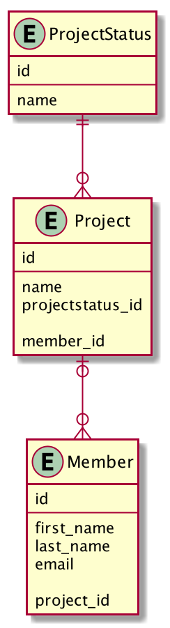

# HttpServer

This is a small HttpServer that is reading files and answering requests.
The project is done for our examn at Høyskolen Kristiania.

To start of the project you need to implement your own file called pgr203.properties with this structure:
dataSource.url= ...
dataSource.username= ...
dataSource.password= ...

Use your own database, username and password to use this program.

Start the server by running the main method in httpServer ->
Type localhost:8080/index.html in your URL, or click the link that appears in your console. You could also do the previous and run the program by using the debugger as well as write the command: java -jar target/httpserver-1.0-SNAPSHOT.jar in your terminal or commandline.

When you launch the program you will be able to add and display members. You can also add projects, assign projectstatus and add members to your project.
There is also a function to change status of a project. If you'd like to you can filter your projects according to member and status.

##Video fra parprogrammering
https://youtu.be/Vz7Qzl-Y1H8

##Database-uml

